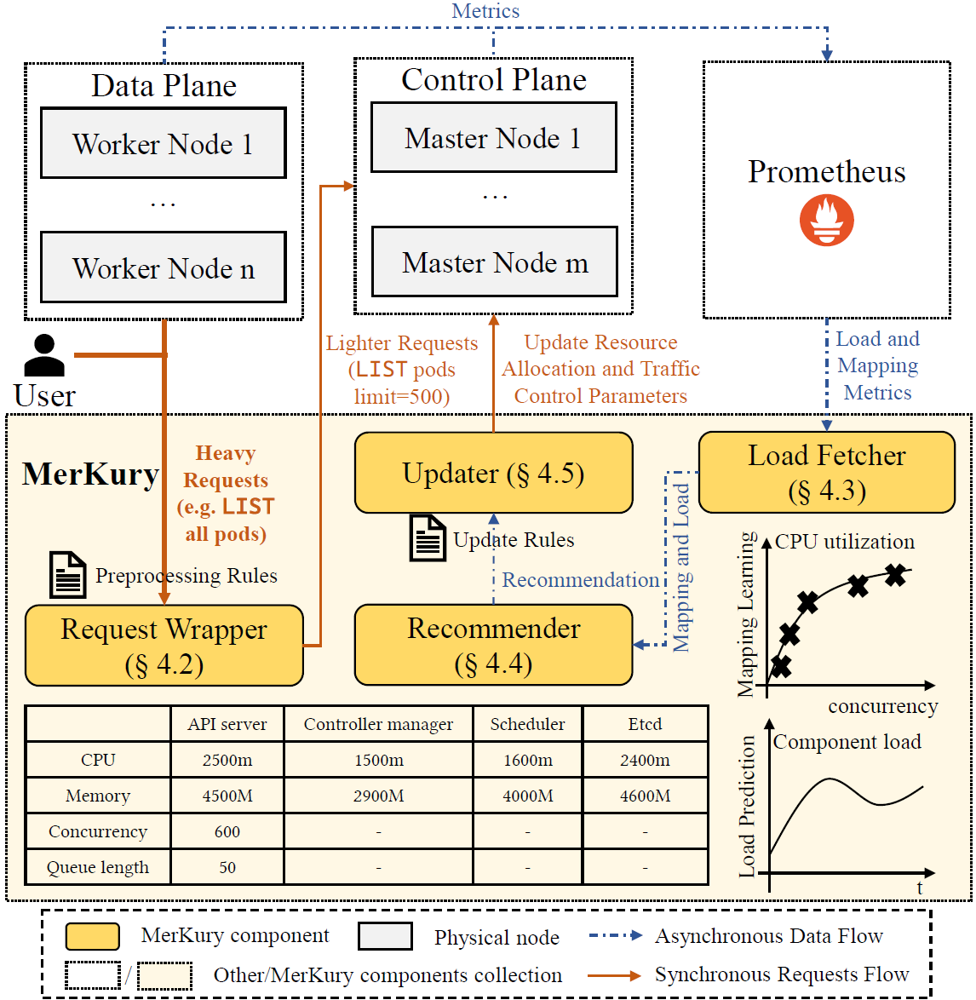
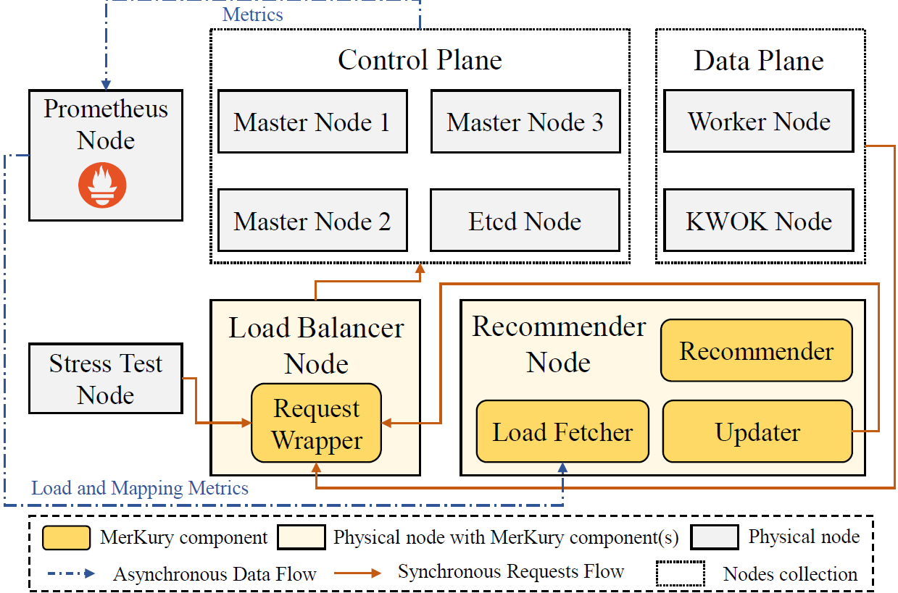
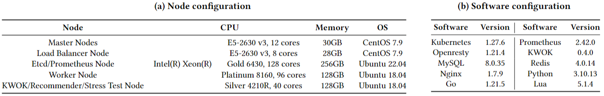

# MerKury - WWW
Code repo for "Mer**K**ury: Adaptive Resource Allocation to Enhance the **K**ubernetes Performance for Large-Scale Clusters" submitted to WWW '25

## Directory structure

- config

  YAML configuration files.

  - kwok: KWOK node example
  - monitor: `endpoints`, `services`, `serviceAccounts`, and `clusterRoleBindings` related to monitoring system
  - prom: Prometheus configurations and related resources (`serviceMonitors` and rules)
  - test-control-plane: control plane components managed by `statefulSet`
    - native: arguments set for "k8s-native" baseline
    - Arguments for other baselines are the same.
  - updater: resources related to the updater

- core

  Implementation of main components and the constructed queue model.

  - load_fetcher: the load fetcher
  - queue_model: constructed queue model
  - recommender: the recommender
  - request-wrapper: request wrapper implemented in Lua with Openresty
    - cert: Kubernetes certificates
    - conf: config file
    - lua: Lua script implementing preprocessing rules
  - updater: the updater

- perf-tests

  Use Clusterloader2 cloned from [kubernetes/perf-tests: Performance tests and benchmarks (github.com)](https://github.com/kubernetes/perf-tests) to simulate scheduling a large number of pods in large-scale clusters. Scripts for simulation are in the directory.

- scripts

  Scripts for queue model simulation, system evaluation, and metrics calculation.

  - queue-model: queue model simulation and monotonicity check scripts
  - main.py: run a set of main components bound with a master node
  - auto-test.py: run a series of simulations automatically
  - clean.py: clean resources created in simulations
  - reset-control-plane.py: restart all control plane components sequentially
  - stress-test.py: run stress test
  - cl2-metric.py: calculate Clusterloader2-related metrics
  - request-latency.py: calculate request latencies during the simulation
  - recommend-cost.py: calculate time and resource cost of the recommendation and update

- stress-test

  Stress test (generating a mix of CRUD requests) implementation.

## Environment

- experiment setup

  

- HW/SW configuration

  

